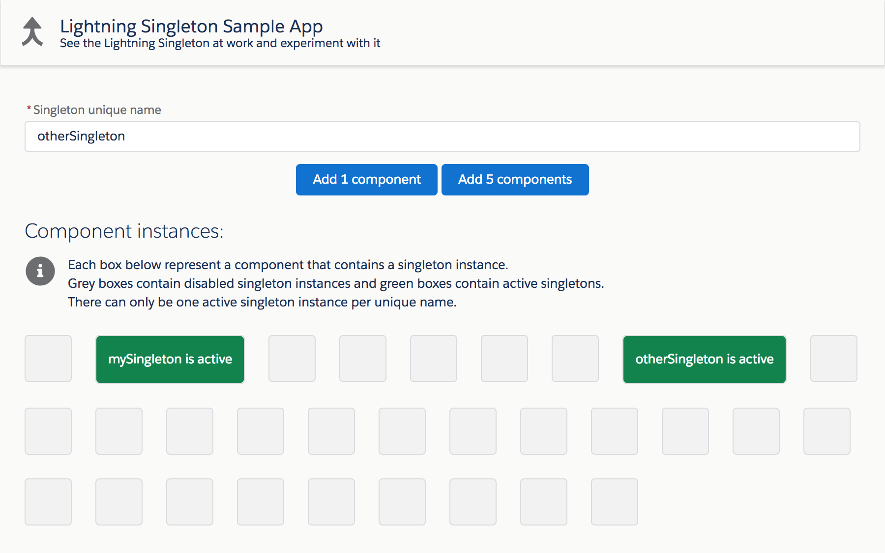

# Salesforce Lightning Singleton Component

## About
The Singleton component enforces a singleton pattern: there can only be one active instance with a given name in a Lightning page context.<br/>
This is useful when using libraries that must be loaded only once per page and when we have no control over the rest of the page.

The singeton uses a built-in synchronization mechanism based on application events and unique hashes in order to ensure that there is only one active instance per unique name.

Note that Singleton acts as a wrapper component so it has no user interface of its own.

Singleton guarantees the following:

- only one randomly selected instance is activated and loads its encapsulated content.
- all existing other instances are deactivated without loading their encapsulated content.
- if other instances are added later in the same page, they will be instantly deactivated.
- the `init` function of the singleton's child components will only be called once


## Installation

Deploy the component and the sample application with Salesforce DX by clicking on this button:

[](https://deploy-to-sfdx.com)


## Documentation
The component is documented using Aura documentation. Access it from this URL (replace the domain):<br/>
https://<b>&lt;YOUR_DOMAIN&gt;</b>.lightning.force.com/docs/component-library/bundle/c:Singleton

### Example 1: Static child component

Use the singleton by giving it a unique name and embedding some content in it.

```xml
<c:Singleton
    name="mySingleton"
    childComponent="{type: 'c:Child', attributes: { label: 'some label' }}">
</c:Singleton>
```

### Example 2: Dynamic child component
1. Configure child component in controller or helper
```js
const singletonChild = {
    type: 'lightning:icon',
    attributes: {
        iconName: 'action:approval',
        alternativeText: 'Approved'
    }
};
component.set('v.singletonChild', singletonChild);
```
2. Use the singleton with the child component configuration:
```xml
<c:Singleton
    name="myOtherSingleton"
    childComponent="{!v.singletonChild}">
</c:Singleton>
```

## Sample application
The default installation includes the Singleton component and a sample application available under this URL (replace the domain):<br/>
https://<b>&lt;YOUR_DOMAIN&gt;</b>.lightning.force.com/c/SampleSingletonApp.app

If you wish to install manually the project without the sample app, edit `sfdx-project.json` and remove the `src-sample` path.


